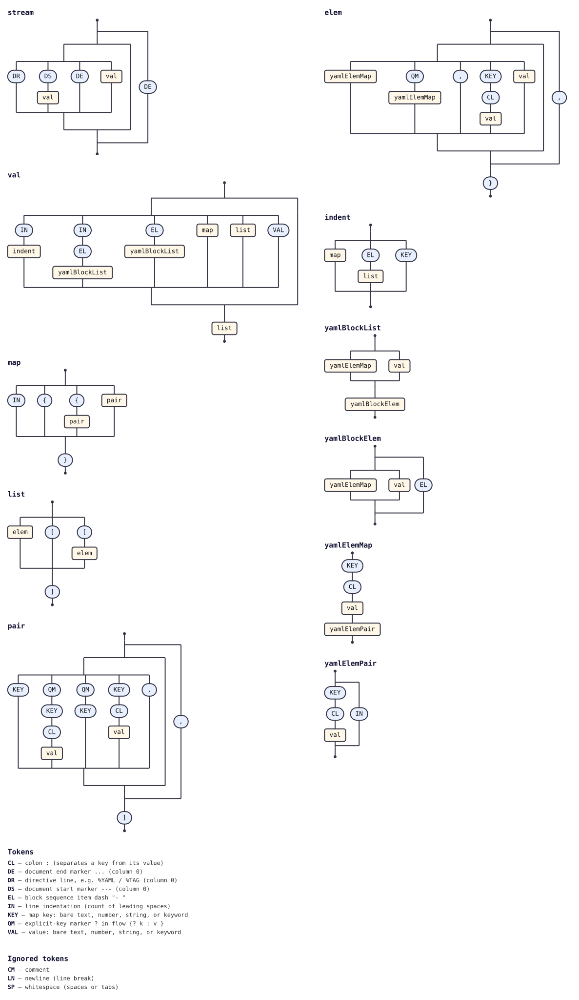

# @tabnas/yaml

A [Tabnas](https://jsonic.senecajs.org) plugin that parses YAML into plain JavaScript objects or Go values, using
Tabnas's extensible grammar engine.

Available for both **TypeScript/JavaScript** (npm) and **Go**.

[](https://www.npmjs.com/package/@tabnas/yaml)
[](https://github.com/tabnas/yaml/blob/main/LICENSE)


## Documentation

Full docs follow the [Diataxis](https://diataxis.fr) structure
(tutorials / how-to guides / reference / explanation):

- [**TypeScript / JavaScript**](doc/yaml-ts.md)
- [**Go**](doc/yaml-go.md)


## Features

- Block mappings and sequences (indentation-based)
- Flow collections (`{a: 1, b: 2}`, `[1, 2, 3]`)
- Quoted scalars (single and double), including multiline
- Block scalars (literal `|` and folded `>`) with chomping indicators
- Anchors (`&name`) and aliases (`*name`), including merge keys (`<<`)
- Multi-document streams (`---` / `...`)
- YAML value keywords (`true`/`false`/`yes`/`no`/`on`/`off`, `null`/`~`, `.inf`, `.nan`)
- Comments (`#`)
- Tags and `%TAG` directives
- Hex (`0x`), octal (`0o`), and binary (`0b`) integer literals
- Tested against the official [YAML Test Suite](https://github.com/yaml/yaml-test-suite)


## Quick start

### Node.js

```bash
npm install @tabnas/yaml @tabnas/jsonic @tabnas/parser
```

```js
const { Tabnas } = require('@tabnas/parser')
const { jsonic } = require('@tabnas/jsonic')
const { Yaml } = require('@tabnas/yaml')

const j = new Tabnas().use(jsonic).use(Yaml)
j.parse("name: Alice\nitems:\n  - one\n  - two\n")   // => { name: 'Alice', items: ['one', 'two'] }
```

See [doc/yaml-ts.md](doc/yaml-ts.md) for the full guide.

### Go

```bash
go get github.com/tabnas/yaml/go
```

```go
import yaml "github.com/tabnas/yaml/go"

result, err := yaml.Parse("name: Alice\nitems:\n  - one\n  - two\n")
// map[name:Alice items:[one two]]
```

See [doc/yaml-go.md](doc/yaml-go.md) for the full guide.


## Development

A `Makefile` at the repo root drives both builds:

```bash
make           # embed grammar, build, and test both TS and Go
make test      # run both test suites
make test-ts   # Node.js tests only
make test-go   # Go tests only
make embed     # re-embed yaml-grammar.jsonic into ts/src/yaml.ts and go/yaml.go
make reset     # clean install, rebuild, and re-test everything
```

The grammar definition lives in the repo-root [`yaml-grammar.jsonic`](../yaml-grammar.jsonic)
and is embedded into `ts/src/yaml.ts` and `go/yaml.go` by
`embed-grammar.js`. After editing the grammar file, run `make embed`
to re-sync the source files.


## Grammar diagram

The installed grammar as a railroad/syntax diagram, generated from the live
grammar with [`@tabnas/railroad`](https://github.com/tabnas/railroad):



A vertical ASCII version is in [`doc/grammar.txt`](doc/grammar.txt).

## License

[MIT](LICENSE) — Copyright (c) 2021 tabnas
